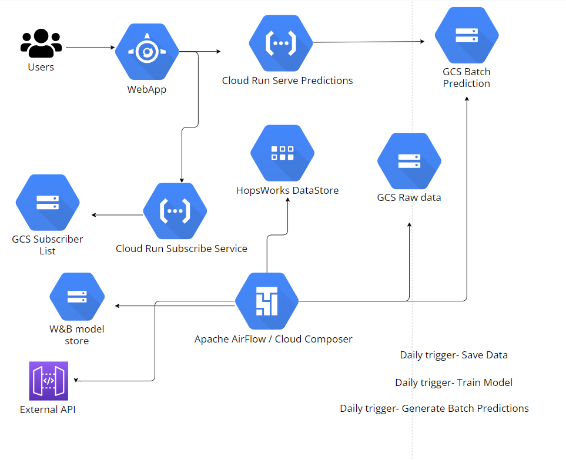

<!-- PROJECT LOGO -->
 

  

  

  

<h3 align="center">FPL Price Change Batch Predicition</h3>

  

    A full end-to-end batch prediction pipeline. Built to predict price changes to players in the Fantasy Premier League (FPL) Football Game. If individual players in your team are set to change price, the pipeline will email you a notification of this before it happens overnight, to allow you to adjust your transfer strategy accordingly. 
   

<!-- ABOUT THE PROJECT -->
## About The Project

This project was built both as an educational exercise for the author, but more importantly, to solve the issue of missing price changes for users of the FPL game.

This issue occurs often in FPL - a user might wish to buy or sell a player, but find that they may no longer be able to afford their planned transfers. A player starts the game with £100m budget and must plan transfers of players into their team accordingly.

Player's price changes occur overnight (GMT) and thus a 6 pm GMT warning in advance of predicted price changes is a useful tool.

  

Each individual section of the pipeline (feature engineering, training, batch prediction, web app) is in separate sections of this GitHub repo. Each has their own ReadME to describe their implementation.

(<a href="#readme-top">back to top</a>)

### Prerequisites

The environment and its library versions are saved in this repo as ***

Deploying this pipeline locally will require accounts with Hopswork, GCP and Weight & Biases.

(<a href="#readme-top">back to top</a>)

<!-- CONTACT -->
## Contact

Tom Ribaroff - tomribaroff@gmail.com

Project Link: [https://github.com/github_username/repo_name](https://github.com/github_username/repo_name)

(<a href="#readme-top">back to top</a>)

<!-- ACKNOWLEDGMENTS -->
## Acknowledgments

The inspiration for building this project came after reading Paul Iusztin's Medium Blog: 

https://www.pauliusztin.me/courses/the-full-stack-7-steps-mlops-framework

(<a href="#readme-top">back to top</a>)

